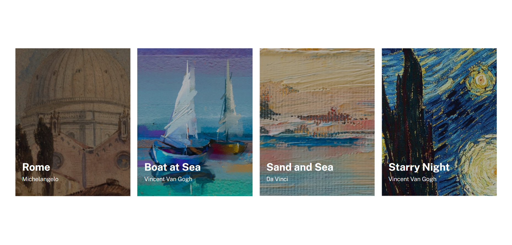
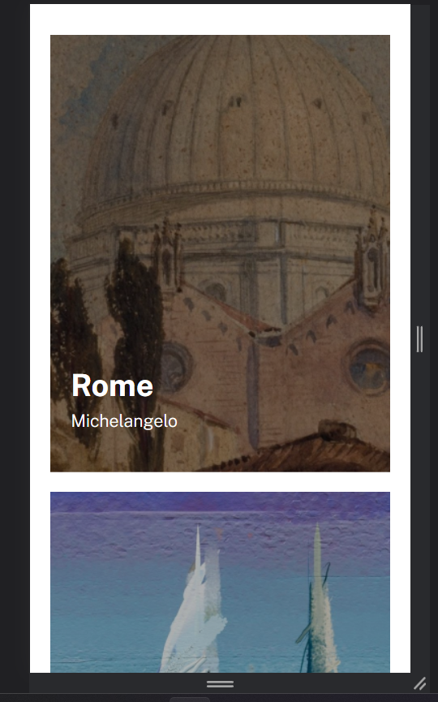

Este é o SEGUNDO exercício de nível avançado (HTML e CSS) do curso de Desenvolvedor Web Full stack da Dev em Dobro.

"Use os conhecimentos que aprendeu no módulo de CSS Avançado - Flexbox pra resolvê-lo da melhor forma, leia atentamente a descrição do exercício que está no PDF abaixo." - Dev em Dobro.

Os materiais de apoio para a realização do projeto foram disponibilizados no Figma:

https://www.figma.com/file/DYk9DZr6urB9MZ4iNt1a61/Desafio-HTML-%2B-CSS?type=design&node-id=3-36&mode=design&t=ANoLysly88BmwCIA-0

<head>
A família da fonte foi obtida no Google Fonts, em que se selecionou os dois pesos indicados (300 e 700) para uso. O link para a fonte foi adicionado no do HTML5, como indicado no próprio Google Fonts e definido o tipo de fonte do projeto no arquivo CSS3 de estilo, no , assim englobando tudo que estiver dentro dele.

Além da fonte, também foram linkados os arquivos CSS3.
</head>

<body>

No corpo do HTML5 foi criada a seção principal e em seguida uma section e dentro dela foram estruturadas 4 divs (uma para cada pintura).
Dentro de cada div de pintura foi adicionada uma imagem, com texto alternativo, e outra div para concentrar o elemento texto (o nome da pintura e seu respectivo autor).
Foram criadas classes para cada um desses elementos, para que no CSS3 elem pudessem ser modificados da maneira que o projeto requeriu.

</body>

//CSS3

A partir das classes e tags do HTML, os arquivos CSS puderam caracterizar cada um.
Foram criados dois arquivos CSS: reset.css e style.css.

No reset retirou-se as características automáticas de margin, padding e adicinou-se a característica box-sizing: border box. Essa característica é muito importante para que as dimensões definidas no projeto para cada imagem sejam mantidas.

Cada elemento recebeu uma classe para ser estilizado no arquivo style.css, recebendo características de tamanho de fonte, força da fonte, cor de letra, espaçamento entre os elementos.

Para o texto ficar sobre a imagem, na posição indicada, foram utilizados posicionamentos dos elementos. O elemento pai recebeu o estilo position: relative, e o elemento filho recebeu o position: absolute. Permitindo assim que o texto ficasse sobre a imagem e no local definido (usando distâncias do fundo e da esquerda para o posicionamento propriamente dito) para cada pintura.

A responsividade dessa página foi obtida usando propriedades flex (display flex e flex-wrap: wrap) juntamento com o box-sizing. Foi adicionada uma @mediaquery para até  1440px de largura de página, sendo que a partir dela houvesse um margin-top, deixando a página mais suave visualmente. 

//CSS

Obs.: quando fiz o exercício sozinha, usei o conceito de listas para dispor os elementos principais. Porém quando acompanhei a resolução em vídeo disponibilizada na plataforma da Dev em Dobro, pude ver outra forma de fazer que acabou usando menos código, deixando o CSS menos poluído e mais fluido e assim adequei o que havia feito anteriormente.

Exemplo de como ficou a página em telas maiores:

Exemplo de como ficou a página em telas menores:

O flex-box é uma ferramenta interessante para organizar os elementos na tela e deixá-los concisos (relacionados) entre si, o que facilita a responsividade da página mesmo sem o uso de media query ou alguma outra especificidade.

Obrigada por acompanhar o início do meu trabalho. Lívia.